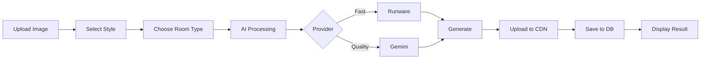

# VirtualStaging.cl - AI Virtual Staging Platform

Professional AI-powered virtual staging for real estate, interior design, and property marketing. Transform empty spaces into stunning, market-ready properties in seconds.

## 🚀 Quick Start

```bash
# Install dependencies
pnpm install

# Setup environment
cp .env.example .env.local

# Run development server
pnpm dev

# Build for production
pnpm build
```

## 📋 Overview

VirtualStaging.cl is a B2B/B2C SaaS platform that provides instant, photorealistic virtual staging using advanced AI technology. Built for the Chilean and Latin American markets, it serves real estate agencies, property developers, interior designers, and individual homeowners.

### Key Features

- **🏠 Multi-Environment Support**: Interior, exterior, commercial spaces
- **🎨 Custom Styles**: Create and save brand-specific designs
- **⚡ Batch Processing**: Stage multiple rooms simultaneously
- **🔄 Multiple Variations**: Generate different design options per space
- **📊 Project Management**: Organize stagings by property/client
- **💰 Token Economy**: Flexible package-based pricing
- **🌐 Cloudflare CDN**: Fast, global image delivery
- **🔒 Enterprise Security**: Row-level security, JWT auth

## 🛠 Tech Stack

### Core Technologies

| Component | Technology | Version | Purpose |
|-----------|------------|---------|---------|
| Framework | Next.js | 15.5.2 | React framework with App Router |
| Language | TypeScript | 5.x | Type safety |
| Database | Supabase | Latest | PostgreSQL + Auth + Real-time |
| UI Library | Shadcn/ui | Latest | Component library |
| Styling | Tailwind CSS | 4.x | Utility-first CSS |
| AI Provider 1 | Runware | API | Fast virtual staging |
| AI Provider 2 | Gemini | 2.5 Flash | High-quality generation |
| Image Storage | Cloudflare | Images API | CDN + optimization |
| Payments | Flow Chile | API | Local payment processing |

### Architecture

```
┌─────────────────────────────────────────────────┐
│                   Frontend (Next.js)             │
│  ┌──────────┐ ┌──────────┐ ┌──────────┐        │
│  │  Landing │ │Dashboard │ │ Projects │        │
│  └──────────┘ └──────────┘ └──────────┘        │
└─────────────────────────────────────────────────┘
                        │
                        ▼
┌─────────────────────────────────────────────────┐
│                  API Routes                      │
│  ┌──────────┐ ┌──────────┐ ┌──────────┐        │
│  │  Auth    │ │Generation│ │  Images  │        │
│  └──────────┘ └──────────┘ └──────────┘        │
└─────────────────────────────────────────────────┘
                        │
        ┌───────────────┼───────────────┐
        ▼               ▼               ▼
┌──────────────┐ ┌──────────────┐ ┌──────────────┐
│   Supabase   │ │  Cloudflare  │ │ AI Providers │
│   Database   │ │    Images    │ │Runware/Gemini│
└──────────────┘ └──────────────┘ └──────────────┘
```

## 📁 Project Structure

```
virtualstagingcl/
├── src/
│   ├── app/                    # Next.js App Router
│   │   ├── (auth)/             # Authentication pages
│   │   ├── (dashboard)/        # Protected dashboard
│   │   ├── (admin)/            # Admin panel
│   │   ├── api/                # API routes
│   │   └── layout.tsx          # Root layout
│   ├── components/             # React components
│   │   ├── ui/                 # Shadcn components
│   │   ├── auth/               # Auth components
│   │   └── projects/           # Project components
│   ├── lib/                    # Core libraries
│   │   ├── ai/                 # AI integration
│   │   │   ├── client.ts       # AI orchestrator
│   │   │   ├── providers/      # AI providers
│   │   │   │   ├── runware.ts  # Runware integration
│   │   │   │   └── gemini.ts   # Gemini integration
│   │   │   └── virtual-staging.ts
│   │   ├── supabase/           # Database client
│   │   └── cloudflare-images.ts
│   ├── hooks/                  # React hooks
│   └── types/                  # TypeScript types
├── supabase/
│   ├── migrations/             # Database migrations
│   └── seed.sql               # Seed data
└── public/                     # Static assets
```

## 💾 Database Schema

### Core Tables

#### `profiles` - User accounts and settings
```sql
- id: UUID (PK)
- email: TEXT
- full_name: TEXT
- tokens_available: INTEGER
- tokens_total_purchased: INTEGER
- tokens_total_used: INTEGER
- role: TEXT (user/admin)
- created_at: TIMESTAMP
```

#### `projects` - Property/client containers
```sql
- id: UUID (PK)
- user_id: UUID (FK)
- name: VARCHAR(255)
- description: TEXT
- status: VARCHAR(50)
- total_images: INTEGER
- total_tokens_used: INTEGER
- is_public: BOOLEAN
- share_token: VARCHAR(100)
```

#### `project_images` - Base room photos
```sql
- id: UUID (PK)
- project_id: UUID (FK)
- name: TEXT
- original_image_url: TEXT
- original_cloudflare_id: TEXT
- upload_order: INTEGER
- status: VARCHAR(50)
```

#### `staging_generations` - AI-generated designs
```sql
- id: UUID (PK)
- project_image_id: UUID (FK)
- style_id: UUID (FK)
- room_type_id: UUID (FK)
- custom_style_id: UUID (FK)
- processed_image_url: TEXT
- processed_cloudflare_id: TEXT
- prompt_used: TEXT
- status: TEXT
- tokens_consumed: INTEGER
- processing_time_ms: INTEGER
```

#### `custom_styles` - User-defined styles
```sql
- id: UUID (PK)
- user_id: UUID (FK)
- name: VARCHAR(255)
- description: TEXT
- prompt_template: TEXT
- category: VARCHAR(50)
- is_public: BOOLEAN
- usage_count: INTEGER
```

#### `staging_styles` - Predefined styles
```sql
- id: UUID (PK)
- code: TEXT (UNIQUE)
- name: TEXT
- base_prompt: TEXT
- category: TEXT
- token_cost: INTEGER
```

#### `room_types` - Space categories
```sql
- id: UUID (PK)
- code: TEXT (UNIQUE)
- name: TEXT
- environment_type: VARCHAR(50)
```

#### `token_packages` - Pricing packages
```sql
- id: UUID (PK)
- name: TEXT
- token_amount: INTEGER
- price: DECIMAL
- currency: TEXT
- is_featured: BOOLEAN
```

## 🔌 API Endpoints

### Authentication
- `POST /api/auth/login` - User login
- `POST /api/auth/signup` - User registration
- `POST /api/auth/logout` - Logout
- `GET /api/auth/session` - Get current session

### Projects
- `GET /api/projects` - List user projects
- `POST /api/projects` - Create project
- `GET /api/projects/[id]` - Get project details
- `PUT /api/projects/[id]` - Update project
- `DELETE /api/projects/[id]` - Delete project

### Image Management
- `POST /api/images/upload` - Direct upload to Cloudflare Images
- `GET /api/images/upload` - Get direct upload URL for client-side
- `GET /api/images/download` - Download image from Cloudflare
- `POST /api/projects/[id]/upload-image` - Upload base image to project
- `GET /api/base-images/[id]/variants` - Get all variants
- `POST /api/base-images/[id]/generate-variant` - Generate design

### Generation
- `POST /api/generate` - Generate staging
- `POST /api/batch/generate` - Batch generation
- `GET /api/generation/[id]/status` - Check status

### Styles
- `GET /api/styles` - List available styles
- `POST /api/styles` - Create custom style
- `PUT /api/styles/[id]` - Update style
- `DELETE /api/styles/[id]` - Delete style

### Tokens & Payments
- `GET /api/tokens/packages` - Available packages
- `POST /api/tokens/purchase` - Purchase tokens
- `GET /api/tokens/balance` - Check balance
- `GET /api/tokens/transactions` - Transaction history

## 🎨 AI Generation Pipeline



### Generation Flow

1. **Image Upload**: Validate and compress if needed
2. **Style Selection**: Predefined or custom style
3. **AI Processing**: Route to appropriate provider
4. **CDN Upload**: Store result in Cloudflare
5. **Database Update**: Save URLs and metadata
6. **User Display**: Show staged image

## 🚢 Deployment

### Environment Variables

```env
# Supabase
NEXT_PUBLIC_SUPABASE_URL=https://xxx.supabase.co
NEXT_PUBLIC_SUPABASE_ANON_KEY=xxx
SUPABASE_SERVICE_ROLE_KEY=xxx

# Cloudflare Images
CLOUDFLARE_ACCOUNT_ID=xxx
CLOUDFLARE_IMAGES_API_TOKEN=xxx
NEXT_PUBLIC_CLOUDFLARE_IMAGES_URL=https://imagedelivery.net/xxx

# AI Services
RUNWARE_API_KEY=xxx
GEMINI_API_KEY=xxx

# Flow Chile Payments
FLOW_API_KEY=xxx
FLOW_SECRET_KEY=xxx
NEXT_PUBLIC_FLOW_ENVIRONMENT=production

# Application
NEXT_PUBLIC_APP_URL=https://virtualstaging.cl
NEXT_PUBLIC_SITE_NAME=VirtualStaging.cl
ADMIN_EMAIL=admin@virtualstaging.cl
```

### Production Deployment

```bash
# Build application
pnpm build

# Run database migrations
pnpm supabase:migrate

# Start production server
pnpm start
```

### Railway Deployment

```yaml
# railway.toml
[build]
builder = "nixpacks"
buildCommand = "pnpm build"

[deploy]
startCommand = "pnpm start"
healthcheckPath = "/api/health"
restartPolicyType = "always"
```

## 📊 Performance Metrics

| Metric | Target | Current |
|--------|--------|---------|
| Generation Time | < 30s | 25s |
| Image Upload | < 5s | 3s |
| Page Load | < 2s | 1.5s |
| API Response | < 500ms | 300ms |
| Uptime | 99.9% | 99.95% |
| Success Rate | > 95% | 97% |

## 🧪 Testing

```bash
# Run all tests
pnpm test

# Unit tests
pnpm test:unit

# Integration tests
pnpm test:integration

# E2E tests with Playwright
pnpm test:e2e

# Test with UI
pnpm test:ui
```

## 🔐 Security

- **Authentication**: Supabase Auth with JWT
- **Authorization**: Row Level Security (RLS)
- **API Protection**: Middleware validation
- **Input Validation**: Zod schemas
- **Rate Limiting**: API route throttling
- **HTTPS Only**: Enforced in production
- **CORS**: Configured for API access
- **Secrets**: Environment variables

## 📚 Documentation

- [API Documentation](./docs/API.md)
- [Database Schema](./docs/DATABASE.md)
- [Deployment Guide](./docs/DEPLOYMENT.md)
- [Style Guide](./docs/STYLES.md)

## 🤝 Contributing

1. Fork the repository
2. Create feature branch (`git checkout -b feature/amazing`)
3. Commit changes (`git commit -m 'Add feature'`)
4. Push to branch (`git push origin feature/amazing`)
5. Open Pull Request

## 📝 License

Proprietary - VirtualStaging.cl © 2024

## 🆘 Support

- Email: support@virtualstaging.cl
- Documentation: docs.virtualstaging.cl
- Status: status.virtualstaging.cl

---

Built with ❤️ in Chile 🇨🇱