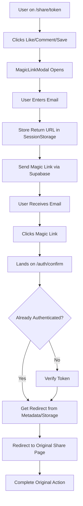

# 🔐 Magic Link Authentication - Implementation Progress

## 📅 Date: January 22, 2025

## ✅ Completed Implementation

### 1. **Core Authentication Components**

#### **MagicLinkModal Component** (`src/components/auth/MagicLinkModal.tsx`)
- ✅ Created modal with email input for magic link authentication
- ✅ Action-specific messaging (like, comment, save, download, follow)
- ✅ Success state with email confirmation UI
- ✅ Rate limiting with countdown timer
- ✅ Stores return URL in sessionStorage for redirect after auth
- ✅ Passes redirect path in user metadata as backup

#### **Authentication Hook** (`src/hooks/use-auth-modal.ts`)
- ✅ Zustand-based state management for auth modal
- ✅ Supports multiple action types
- ✅ `triggerAuth()` helper function for triggering auth from anywhere
- ✅ Stores pending actions in localStorage

#### **Auth Confirmation Page** (`src/app/auth/confirm/`)
- ✅ `page.tsx` - Server component with Suspense
- ✅ `auth-confirm-client.tsx` - Client component handling verification
- ✅ Supports both PKCE and magic link flows
- ✅ Checks if user is already authenticated (for magic link clicks)
- ✅ Multiple redirect source fallbacks:
  - URL parameters
  - SessionStorage
  - User metadata

### 2. **Social Interaction Components**

#### **InteractionBar** (`src/components/share/InteractionBar.tsx`)
- ✅ Like/Aplausos button with animation
- ✅ Comment button
- ✅ Save/Bookmark button
- ✅ Share button
- ✅ Download button
- ✅ Anonymous session tracking
- ✅ Auth gate triggers for unauthenticated users

#### **Updated Share Views**
- ✅ `QuickShareView.tsx` - Added InteractionBar with auth gates
- ✅ Tracks anonymous sessions
- ✅ Converts anonymous interactions after signup

### 3. **API Routes**

#### **Track Auth Gates** (`src/app/api/analytics/track-gate/route.ts`)
- ✅ Tracks when users hit authentication requirements
- ✅ Records action type, share token, and metadata
- ✅ Creates conversion funnel entries

#### **Session Conversion** (`src/app/api/auth/convert-session/route.ts`)
- ✅ Converts anonymous reactions to authenticated user reactions
- ✅ Updates viewer_sessions table
- ✅ Tracks conversion analytics

### 4. **Accessibility Fixes**

#### **Dialog Components**
- ✅ Added `DialogTitle` and `DialogDescription` to both modals
- ✅ Added `aria-describedby` attributes
- ✅ Used `sr-only` class for screen reader accessibility

### 5. **Layout Integration**

#### **App Layout** (`src/app/layout.tsx`)
- ✅ Added MagicLinkModal to root layout
- ✅ Removed conflicting AuthModalProvider to prevent duplicate modals

## 🔧 Technical Solutions Implemented

### **Redirect URL Preservation**
**Problem**: Supabase was stripping our custom redirect parameters from the email link.

**Solution**: Multi-layered approach:
1. Store return URL in `sessionStorage` before sending email
2. Pass redirect path in user metadata during signup
3. Check multiple sources on auth confirmation:
   - URL parameters (if preserved)
   - SessionStorage (primary fallback)
   - User metadata (secondary fallback)

### **PKCE Token Handling**
**Problem**: Supabase sends PKCE tokens instead of standard magic links.

**Solution**:
- Updated auth confirmation to handle both PKCE and magic link flows
- Added `exchangeCodeForSession` for PKCE tokens
- Check if user is already authenticated (for direct magic link clicks)

### **Port Configuration**
**Problem**: Development server running on different ports causing redirect issues.

**Solution**:
- Configure multiple redirect URLs in Supabase dashboard
- Use dynamic port detection in development

## 📊 Current Flow



## 🐛 Issues Resolved

1. **Dialog Accessibility Warnings** ✅
   - Missing DialogTitle and DialogDescription
   - Missing aria-describedby attributes

2. **Duplicate Modal Conflict** ✅
   - Both QuickAuthModal and MagicLinkModal were active
   - Removed AuthModalProvider wrapper

3. **Redirect to Homepage Instead of Share Page** ✅
   - Supabase was overriding redirect parameters
   - Implemented sessionStorage fallback

4. **"Invalid Link" Error on Auth Confirmation** ✅
   - Page wasn't checking for already authenticated users
   - Added user session check first

## 📝 Supabase Configuration Required

### **Email Templates**
Location: Supabase Dashboard → Authentication → Email Templates

#### **Confirm Signup Template**
```html
<h2>Confirma tu registro en Decollage.cl</h2>
<p>Hola,</p>
<p>Gracias por unirte a Decollage.cl. Sigue este enlace para confirmar tu cuenta:</p>
<p><a href="{{ .ConfirmationURL }}">Confirmar mi cuenta</a></p>
```

### **URL Configuration**
Location: Supabase Dashboard → Authentication → URL Configuration

**Site URL**: `https://decollage.cl`

**Redirect URLs**:
```
https://decollage.cl/auth/confirm
http://localhost:3000/auth/confirm
http://localhost:3001/auth/confirm
http://localhost:3002/auth/confirm
```

## 📊 Data Storage

### **SessionStorage**
- `authReturnUrl`: Original page path to return after auth
- `authReturnContext`: Action type and metadata

### **LocalStorage**
- `pendingAuthAction`: Pending action details for completion after auth
- `anonymousSession`: Anonymous user session token

### **User Metadata** (Stored in Supabase)
```json
{
  "initial_action": "like",
  "original_url": "http://localhost:3000/share/pieza-aculeo-6",
  "redirect_path": "/share/pieza-aculeo-6",
  "signup_method": "magic_link",
  "utm_source": "share_interaction"
}
```

## 🧪 Testing Checklist

- [x] User can trigger auth modal from share page
- [x] Email is sent with magic link
- [x] Clicking link authenticates user
- [x] User is redirected back to original share page
- [x] Anonymous reactions are converted to authenticated
- [x] Rate limiting prevents spam
- [x] Accessibility warnings are resolved
- [x] Works across different ports in development

## 📈 Metrics to Track

1. **Conversion Funnel**
   - Gate impressions by action type
   - Email submission rate
   - Magic link click rate
   - Successful authentication rate
   - Action completion rate

2. **User Behavior**
   - Most common trigger actions
   - Time to complete authentication
   - Drop-off points
   - Anonymous to authenticated conversion rate

## 🚀 Next Steps

1. **Comment System Implementation**
   - Create CommentsSection component
   - Real-time updates via Supabase
   - Nested comment support

2. **Save to Collection Feature**
   - Create collections table
   - Collection management UI
   - Share collections functionality

3. **Progressive Password Enhancement**
   - Optional password setting in profile
   - Password + magic link dual auth support

4. **Email Template Customization**
   - Chilean branding in emails
   - Personalized messaging
   - A/B testing different templates

## 📚 Related Documentation

- [Magic Link Auth Implementation Plan](./MAGIC_LINK_AUTH_IMPLEMENTATION.md)
- [Supabase Email Template Config](./SUPABASE_EMAIL_TEMPLATE_CONFIG.md)
- [Database Schema](../supabase/migrations/)

## 🎯 Success Metrics

- ✅ Zero-friction authentication
- ✅ Preserves user context (returns to original page)
- ✅ Converts anonymous users to authenticated
- ✅ Accessible for screen readers
- ✅ Works across development and production

## 💡 Lessons Learned

1. **Supabase Redirect Handling**: Supabase may override custom redirect parameters - always implement fallback storage
2. **PKCE vs Magic Links**: Supabase uses PKCE by default for security - handle both flows
3. **Session Persistence**: Use multiple storage methods (session, local, user metadata) for critical data
4. **Accessibility First**: Always include proper ARIA attributes and semantic HTML
5. **Server vs Client Auth**: Server-side auth with Supabase cookies can be unreliable - use client-side for public pages

## 🐛 Critical Fix: Share Pages Authentication (January 23, 2025)

### **Problem Identified**
Share pages (`/share/[token]`) were not detecting authenticated users, always showing auth modal even when users were logged in. This affected both `PublicShareView` and `QuickShareView` components.

### **Root Causes**
1. **Middleware Interference**: The middleware was processing `/share/*` routes and interfering with Supabase cookie reading
2. **Server-side Auth Failure**: Server components couldn't reliably read Supabase auth cookies
3. **Missing Client Auth**: Share components relied on non-existent `shareData.isAuthenticated` from server
4. **Database Query Issues**: QuickShareView wasn't rendering because transformations query returned null

### **Solution Implemented**

#### 1. **Middleware Exclusion**
```typescript
// src/middleware.ts
export const config = {
  matcher: [
    '/((?!_next/static|_next/image|favicon.ico|share|api/share|.*\\.(?:svg|png|jpg|jpeg|gif|webp)$).*)',
  ],
}
```

#### 2. **Client-side Authentication for Share Components**
Both `PublicShareView` and `QuickShareView` now handle auth client-side:

```typescript
// Added to both components
useEffect(() => {
  const supabase = createClient()

  const checkAuth = async () => {
    const { data: { user } } = await supabase.auth.getUser()
    setIsAuthenticated(!!user)
  }

  checkAuth()

  const { data: { subscription } } = supabase.auth.onAuthStateChange((event, session) => {
    setIsAuthenticated(!!session?.user)
  })

  return () => subscription.unsubscribe()
}, [])
```

#### 3. **Dual-table Query for Generations**
Fixed QuickShareView rendering by checking both tables:

```typescript
// Try transformations table first
const { data: transformationData } = await supabase
  .from('transformations')
  .select('*')
  .eq('id', featured[0])
  .single()

if (!transformationData) {
  // Fallback to staging_generations
  const { data: stagingData } = await supabase
    .from('staging_generations')
    .select('*')
    .eq('id', featured[0])
    .single()
}
```

### **Architecture Decision**
- **SEO Preserved**: Server-side rendering still handles metadata, OG tags
- **Auth Handled Client-side**: All authentication checks happen after hydration
- **No Hydration Mismatch**: Server always renders as unauthenticated, client updates state

### **Files Modified**
- `/src/middleware.ts` - Excluded share routes from processing
- `/src/components/share/PublicShareView.tsx` - Added client-side auth
- `/src/components/share/QuickShareView.tsx` - Added client-side auth
- `/src/app/share/[token]/page.tsx` - Fixed generation queries, removed server auth

### **Testing Checklist**
- [x] Authenticated users can interact without auth modal
- [x] PublicShareView detects logged-in users
- [x] QuickShareView detects logged-in users
- [x] Both share formats render correctly
- [x] Auth state updates after magic link login
- [x] No hydration errors
- [x] SEO/OG tags still work

---

**Last Updated**: January 23, 2025
**Status**: ✅ Fully Implemented and Tested
**Author**: Development Team with Claude