# Supabase + Next.js App Router Authentication Guide

## Common Authentication Issues & Solutions

This guide documents the authentication challenges and solutions when using Supabase with Next.js App Router, particularly for role-based access control (RBAC) and admin dashboards.

## Table of Contents

1. [The Core Problem](#the-core-problem)
2. [Understanding the Architecture](#understanding-the-architecture)
3. [Common Issues](#common-issues)
4. [The Solution Pattern](#the-solution-pattern)
5. [Implementation Guide](#implementation-guide)
6. [Testing Considerations](#testing-considerations)
7. [Best Practices](#best-practices)

## The Core Problem

When implementing authentication with Supabase and Next.js App Router, developers commonly encounter:

- **Client-Server State Mismatch**: Auth state available on server but not on client
- **Hydration Issues**: Client components losing auth context on initial render
- **Cookie Management**: Supabase auth cookies not properly synchronized
- **Role-Based Access**: Middleware allows access but client redirects away
- **Testing Challenges**: Playwright and other E2E tools struggle with Supabase cookies

## Understanding the Architecture

### The Auth Flow

```mermaid
graph TD
    A[User Login] --> B[Server Action]
    B --> C[Supabase Auth]
    C --> D[Set Cookies]
    D --> E[Middleware Check]
    E --> F{Has Valid Session?}
    F -->|Yes| G[Check User Role]
    F -->|No| H[Redirect to Login]
    G --> I{Has Required Role?}
    I -->|Yes| J[Render Page]
    I -->|No| K[Redirect to Dashboard]
    J --> L[Client Hydration]
    L --> M{Auth Context Available?}
    M -->|No| N[⚠️ PROBLEM: Client Redirects]
    M -->|Yes| O[✅ Page Loads]
```



### The Problem Manifestation

```javascript
// What happens in practice:
// 1. Middleware says: "User is admin, allow access to /admin" ✅
// 2. Server Component renders the initial HTML ✅
// 3. Client Component hydrates ✅
// 4. AuthContext initializes ⏳
// 5. AuthContext doesn't find session ❌
// 6. Client redirects to login 😢
```

## Common Issues

### Issue 1: AuthContext Not Initializing on Protected Routes

**Symptoms:**

- User successfully logs in
- Middleware allows access to admin routes
- Client-side AuthContext shows `user: null` and redirects

**Root Cause:**

- Supabase cookies not properly available during client hydration
- Race condition between auth initialization and route protection

### Issue 2: Middleware-Client Discrepancy

**Symptoms:**

- Server logs show user has admin role
- Middleware permits access
- Client component denies access

**Root Cause:**

- Client-side auth check happens before cookies are fully loaded
- Different auth check implementations between server and client

### Issue 3: Testing Authentication Flows

**Symptoms:**

- Playwright tests fail to access protected routes
- Auth cookies show as 0 in test logs
- Manual testing works but automated testing fails

**Root Cause:**

- Server actions don't expose cookies to Playwright context
- Cookie domain/path mismatches in test environment

## The Solution Pattern

### Server-First Authentication

Instead of relying on client-side auth context for protected routes, use server components for auth checks:

```typescript
// ❌ BAD: Client component with auth check
'use client'
export default function AdminDashboard() {
  const { user, loading } = useAuth()

  useEffect(() => {
    if (!loading && !user) {
      router.push('/login') // This causes hydration issues
    }
  }, [user, loading])

  return <div>Admin Dashboard</div>
}

// ✅ GOOD: Server component with auth check
// app/admin/page.tsx
import { createClient } from '@/lib/supabase/server'
import { redirect } from 'next/navigation'
import AdminDashboardClient from './AdminDashboardClient'

export default async function AdminDashboard() {
  const supabase = await createClient()
  const { data: { user } } = await supabase.auth.getUser()

  if (!user) {
    redirect('/login')
  }

  const { data: profile } = await supabase
    .from('profiles')
    .select('role')
    .eq('id', user.id)
    .single()

  if (profile?.role !== 'admin') {
    redirect('/dashboard')
  }

  return <AdminDashboardClient user={user} profile={profile} />
}
```

## Implementation Guide

### 1. Server-Side Auth Helper

```typescript
// lib/supabase/server.ts
import { createServerClient } from '@supabase/ssr'
import { cookies } from 'next/headers'

export async function createClient() {
  const cookieStore = cookies()

  return createServerClient(
    process.env.NEXT_PUBLIC_SUPABASE_URL!,
    process.env.NEXT_PUBLIC_SUPABASE_ANON_KEY!,
    {
      cookies: {
        getAll() {
          return cookieStore.getAll()
        },
        setAll(cookiesToSet) {
          try {
            cookiesToSet.forEach(({ name, value, options }) =>
              cookieStore.set(name, value, options)
            )
          } catch {
            // Server Component cookie handling
          }
        },
      },
    }
  )
}
```

### 2. Middleware Configuration

```typescript
// middleware.ts
export async function middleware(request: NextRequest) {
  const supabase = createServerClient(/* ... */)

  // IMPORTANT: Use getUser() not getSession()
  // getUser() validates the JWT token
  const {
    data: { user },
  } = await supabase.auth.getUser()

  if (!user && isProtectedRoute) {
    return NextResponse.redirect('/login')
  }

  // Fetch user role from database
  const { data: profile } = await supabase
    .from('profiles')
    .select('role')
    .eq('id', user.id)
    .single()

  // Role-based redirects
  if (isAdminRoute && profile?.role !== 'admin') {
    return NextResponse.redirect('/dashboard')
  }

  return NextResponse.next()
}
```

### 3. Protected Route Pattern

```typescript
// app/[locale]/(admin)/admin/page.tsx
import { createClient } from '@/lib/supabase/server'
import { redirect } from 'next/navigation'

async function getAuthenticatedUser() {
  const supabase = await createClient()
  const { data: { user } } = await supabase.auth.getUser()

  if (!user) {
    redirect('/login')
  }

  return user
}

async function requireAdmin(userId: string) {
  const supabase = await createClient()
  const { data: profile } = await supabase
    .from('profiles')
    .select('role')
    .eq('id', userId)
    .single()

  if (profile?.role !== 'admin') {
    redirect('/dashboard')
  }

  return profile
}

export default async function AdminPage() {
  const user = await getAuthenticatedUser()
  const profile = await requireAdmin(user.id)

  return (
    <AdminDashboardClient
      user={user}
      profile={profile}
    />
  )
}
```

### 4. Client Component Pattern

```typescript
// app/[locale]/(admin)/admin/AdminDashboardClient.tsx
'use client'

interface Props {
  user: User
  profile: Profile
}

export default function AdminDashboardClient({ user, profile }: Props) {
  // No auth checks needed - already validated on server
  // Component receives authenticated user as props

  return (
    <div>
      <h1>Welcome, {user.email}</h1>
      <p>Role: {profile.role}</p>
      {/* Admin dashboard content */}
    </div>
  )
}
```

## Testing Considerations

### Playwright Testing Strategy

```typescript
// tests/admin-auth.spec.ts
import { test, expect } from '@playwright/test'
import { createClient } from '@supabase/supabase-js'

test('admin dashboard access', async ({ page, context }) => {
  // Option 1: Direct Supabase Auth
  const supabase = createClient(url, key)
  const { data } = await supabase.auth.signInWithPassword({
    email: 'admin@example.com',
    password: 'password',
  })

  // Set auth cookies manually
  if (data.session) {
    await context.addCookies([
      {
        name: 'sb-[project-id]-auth-token',
        value: JSON.stringify({
          access_token: data.session.access_token,
          refresh_token: data.session.refresh_token,
        }),
        domain: 'localhost',
        path: '/',
      },
    ])
  }

  // Now navigate to protected route
  await page.goto('/admin')
  await expect(page.getByText('Admin Dashboard')).toBeVisible()
})
```

### Database Setup for Tests

```sql
-- Ensure test user has proper role
UPDATE profiles
SET role = 'admin'
WHERE id = (
  SELECT id FROM auth.users
  WHERE email = 'admin@example.com'
);
```

## Best Practices

### 1. Always Use Server Components for Auth Gates

```typescript
// ✅ Server component handles auth
export default async function ProtectedPage() {
  const user = await validateAuth()
  return <ClientComponent user={user} />
}
```

### 2. Separate Auth Logic from UI Components

```typescript
// lib/auth-helpers.ts
export async function requireAuth() {
  const supabase = await createClient()
  const {
    data: { user },
  } = await supabase.auth.getUser()
  if (!user) redirect('/login')
  return user
}

export async function requireRole(userId: string, role: string) {
  const supabase = await createClient()
  const { data: profile } = await supabase
    .from('profiles')
    .select('role')
    .eq('id', userId)
    .single()

  if (profile?.role !== role) {
    redirect('/unauthorized')
  }

  return profile
}
```

### 3. Use Parallel Data Fetching

```typescript
export default async function AdminDashboard() {
  const user = await requireAuth()

  // Fetch data in parallel
  const [profile, stats] = await Promise.all([
    getProfile(user.id),
    getAdminStats()
  ])

  return <AdminDashboardClient {...{ user, profile, stats }} />
}
```

### 4. Handle Loading States Properly

```typescript
// Use Suspense for loading states
export default function AdminLayout({ children }) {
  return (
    <Suspense fallback={<AdminSkeleton />}>
      {children}
    </Suspense>
  )
}
```

### 5. Implement Proper Error Boundaries

```typescript
export default function AdminErrorBoundary({
  error,
  reset,
}: {
  error: Error
  reset: () => void
}) {
  if (error.message.includes('UNAUTHORIZED')) {
    redirect('/login')
  }

  return (
    <div>
      <h2>Something went wrong!</h2>
      <button onClick={reset}>Try again</button>
    </div>
  )
}
```

## Database Considerations

### Profile Table Structure

```sql
CREATE TABLE profiles (
  id UUID PRIMARY KEY REFERENCES auth.users(id),
  role TEXT DEFAULT 'user',
  username TEXT,
  created_at TIMESTAMPTZ DEFAULT NOW(),
  updated_at TIMESTAMPTZ DEFAULT NOW()
);

-- RLS Policies
ALTER TABLE profiles ENABLE ROW LEVEL SECURITY;

-- Users can read their own profile
CREATE POLICY "Users can read own profile" ON profiles
  FOR SELECT USING (auth.uid() = id);

-- Only admins can read all profiles
CREATE POLICY "Admins can read all profiles" ON profiles
  FOR SELECT USING (
    EXISTS (
      SELECT 1 FROM profiles
      WHERE id = auth.uid()
      AND role IN ('admin', 'super_admin')
    )
  );
```

### Ensuring Profile Creation

```typescript
// After user signup
const { data: newUser } = await supabase.auth.signUp({
  email,
  password,
})

if (newUser.user) {
  // Create profile
  await supabase.from('profiles').insert({
    id: newUser.user.id,
    role: 'user',
    username: email.split('@')[0],
  })
}
```

## Debugging Checklist

When auth isn't working:

1. **Check Middleware Logs**

   ```typescript
   console.log('[Middleware] User:', user?.email)
   console.log('[Middleware] Profile:', profile)
   ```

2. **Verify Cookie Presence**

   ```typescript
   const cookies = request.cookies.getAll()
   console.log(
     'Auth cookies:',
     cookies.filter((c) => c.name.includes('sb-'))
   )
   ```

3. **Check Database Role**

   ```sql
   SELECT * FROM profiles WHERE id = 'user-uuid';
   ```

4. **Validate Environment Variables**

   ```typescript
   console.log('Supabase URL:', process.env.NEXT_PUBLIC_SUPABASE_URL)
   console.log('Has anon key:', !!process.env.NEXT_PUBLIC_SUPABASE_ANON_KEY)
   ```

5. **Test Auth Flow Manually**
   - Login with test credentials
   - Check browser DevTools > Application > Cookies
   - Verify `sb-[project]-auth-token` exists
   - Check cookie value contains valid JWT

## Common Pitfalls to Avoid

### ❌ Don't Rely on Client-Side Auth for Protection

```typescript
// BAD: Client can be bypassed
'use client'
export default function AdminPage() {
  const { user } = useAuth()
  if (!user?.isAdmin) return <Unauthorized />
  return <AdminContent />
}
```

### ❌ Don't Use getSession() Without getUser()

```typescript
// BAD: Session might be expired
const {
  data: { session },
} = await supabase.auth.getSession()

// GOOD: Validates the token
const {
  data: { user },
} = await supabase.auth.getUser()
```

### ❌ Don't Forget to Handle Race Conditions

```typescript
// BAD: Might redirect before auth loads
useEffect(() => {
  if (!user) router.push('/login')
}, [user])

// GOOD: Check loading state
useEffect(() => {
  if (!loading && !user) router.push('/login')
}, [loading, user])
```

## Summary

The key to successful Supabase + Next.js authentication is:

1. **Server-first approach** for protected routes
2. **Proper cookie management** in middleware
3. **Separation of concerns** between auth and UI
4. **Consistent role checking** across server and client
5. **Proper testing strategies** that account for cookie handling

By following these patterns, you can avoid the common pitfalls of client-side auth checks and build a robust, secure authentication system.

## Resources

- [Supabase Auth Docs](https://supabase.com/docs/guides/auth)
- [Next.js App Router Auth](https://nextjs.org/docs/app/building-your-application/authentication)
- [Supabase SSR Package](https://supabase.com/docs/guides/auth/server-side/nextjs)
- [Next.js Middleware](https://nextjs.org/docs/app/building-your-application/routing/middleware)

HINT:

⏺ ✅ All Tasks Completed Successfully!

  I've successfully fixed the email verification and updated the button styles:

  1. Email Verification Callback ✅

  Created /src/app/auth/callback/route.ts that:
  - Handles email verification tokens from Supabase
  - Checks user type (B2C vs B2B) after verification
  - Redirects B2C users to /dashboard/projects
  - Redirects B2B users to /dashboard
  - Creates profile if it doesn't exist (defaults to B2C with 5 free tokens)
  - Handles password recovery and invites properly

  2. Button Styles Updated ✅

  Updated all auth form buttons to match the homepage style:
  - Login button: bg-blue-600 hover:bg-blue-700 text-white
  - Signup button: bg-blue-600 hover:bg-blue-700 text-white
  - Forgot password button: bg-blue-600 hover:bg-blue-700 text-white

  3. Smart Redirect Logic ✅

  The auth callback now intelligently redirects users based on:
  - Email verification (signup): B2C → /dashboard/projects, B2B → /dashboard
  - Password recovery: → /reset-password
  - User invites: → /set-password
  - OAuth login: Checks user type and redirects accordingly

  Key Features:

  - Automatic profile creation if user doesn't have one
  - B2C users get 5 free tokens on signup
  - Consistent blue theme across all auth pages
  - Build succeeds without errors